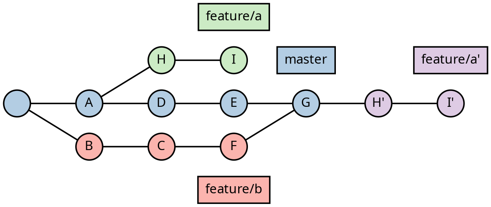

impress.me Demo Presentation
====================================

April 8, 2020 - by [resamsel](https://github.com/resamsel)

## 🧭 Intro [](class=primary-amber)

* Write presentation in Markdown
* Convert to interactive impress.js presentation
* Single HTML file
* Customizable by CSS
* Quickly achieve amazing results

### How?

* Top level heading is title slide
* Second level headings: planets 🌎
* Third level headings: satellites 🛰️
* Further headings: content 📖

### CLI Usage

* First param: input markdown file
* Second param: optional output file

```bash
# Convert Demo.md to Demo.html
impress.me Demo.md

# Convert INPUT.md to My Fancy Presentation.html
impress.me INPUT.md 'My Fancy Presentation.html'
```

### CLI Options

* `--cssFiles`: multiple CSS files to be included
* `--transitionDuration`: time between slides in millis

```bash
# Convert Demo.md with additional stylesheets
impress.me Demo.md --cssFiles a.css b.css
```

## 🧰 Features [](class=primary-blue)

* Markdown

### Emphasis

* *Emphasis*: `*asterisks*` or `_underscore_`
* **Strong emphasis**: `double **asterisks** or __underscore__`
* ~~Strike through~~: `~~two tildes~~`

### Lists

1. `1. ...`: Numbered lists
   1. `  1. ...`: Nested lists
1. `* ...`: Unordered lists

### Quotes

> This is a blockquote, spanning multiple lines with a footer at the end
> <footer>The author</footer>

### Code

* Uses `highlight.js` for syntax highlighting
* `Inline Code`: surrounded by back-ticks
* Code block: surrounded by 3 back-ticks

```javascript
// Code block with syntax highlighting
console.log('Hello World!');
```

### Execute Code [](class=focus-dual image-shadow)



````markdown
```dot,render
digraph G {
    rankdir = "LR";
    ranksep = "0 equally";
    bgcolor = "transparent";

    " " -> A -> D -> E -> G;
    ...
}
```
````

### Links and Images and More

* Inline [link](https://github.com/resamsel/impress.me)
* Reference style [link]
* Inline image:
  
* Reference style image:
  ![alt text][logo]
* Image in link:
  [![alt text][logo]](https://github.com/resamsel/impress.me)

### Positioning

* Automatic positioning
* Square root function
* More to come

## 🖌️ Customization [](class=primary-green)

* Step CSS classes
* `step`: defines a step in the presentation
* `slide`: this step will be displayed as a slide
* `depth-{1,2,3}`: heading level

### Slide Options

* `x, y, z`: custom position
* `scale`: custom size
* `id, class, style`: directly added to DOM element
* See [impress.js documentation](https://github.com/impress/impress.js/blob/master/DOCUMENTATION.md#step-element)

```markdown
## No Options

Will be positioned and scaled according
to the positioning strategy.

## Custom Position Auto Scale [](x=100, y=100)

## Custom Scale Auto Position [](scale=2)
```

### Special Slides

* Special handling in styles
* `class=end`
  * End slide has no heading
  * Sets `id=end`, if unset
* `class=overview`
  * Overview shows all slides
  * Sets `id=overview`, if unset

```markdown
## Last Slide [](class=end)

## Overview [](class=overview)
```

## Layouts [](class=primary-red)

* Multiple layouts
* Single focus
* Pair focus (default)

### Focus Image [](class=focus-image)

![Demo Presentation][demo-presentation]

### Single Focus [](class=focus-single)

Lorem ipsum dolor sit amet, consectetur adipiscing elit, sed do eiusmod tempor incididunt ut labore et dolore magna aliqua. Ut enim ad minim veniam, quis nostrud exercitation ullamco laboris nisi ut aliquip ex ea commodo consequat. Duis aute irure dolor in reprehenderit in voluptate velit esse cillum dolore eu fugiat nulla pariatur. Excepteur sint occaecat cupidatat non proident, sunt in culpa qui officia deserunt mollit anim id est laborum.

### Single Focus Image [](class=focus-single)

![Demo Presentation][demo-presentation]

### Single Focus Code [](class=focus-single)

```bash
echo 'Hello impress.me!'
```

### Dual Focus [](class=focus-dual)

Lorem ipsum dolor sit amet, consectetur adipiscing elit, sed do eiusmod tempor incididunt ut labore et dolore magna aliqua. Ut enim ad minim veniam, quis nostrud exercitation ullamco laboris nisi ut aliquip ex ea commodo consequat. Duis aute irure dolor in reprehenderit in voluptate velit esse cillum dolore eu fugiat nulla pariatur. Excepteur sint occaecat cupidatat non proident, sunt in culpa qui officia deserunt mollit anim id est laborum.

Lorem ipsum dolor sit amet, consectetur adipiscing elit, sed do eiusmod tempor incididunt ut labore et dolore magna aliqua. Ut enim ad minim veniam, quis nostrud exercitation ullamco laboris nisi ut aliquip ex ea commodo consequat. Duis aute irure dolor in reprehenderit in voluptate velit esse cillum dolore eu fugiat nulla pariatur. Excepteur sint occaecat cupidatat non proident, sunt in culpa qui officia deserunt mollit anim id est laborum.

### Dual Focus Image [](class=focus-dual)

![Demo Presentation][demo-presentation]

![Demo Presentation][demo-presentation]

### Dual Focus Code [](class=focus-dual)

```bash
echo 'Hello impress.me!'
```

```bash
echo 'Hello impress.me!'
```

### Dual Focus Grouped [](class=focus-dual)

<div>

> This is a blockquote, spanning multiple lines with a footer at the end
> <footer>The author</footer>

* Item 1
* Item 2

</div>

```markdown
<div>

Left column

* Item 1
* Item 2

</div>

Right column
```

## Overview [](class=overview)

[logo]: https://github.com/adam-p/markdown-here/raw/master/src/common/images/icon48.png "Logo Title Text 2"
[demo-presentation]: images/demo-presentation.png "Demo Presentation"
[link]: http://www.reddit.com
