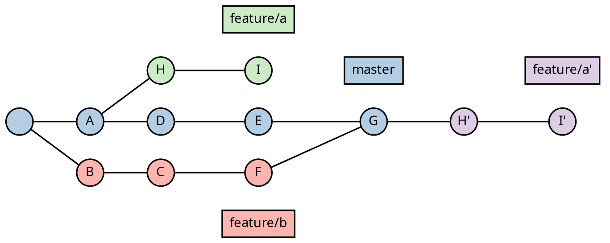

Render Code
===========

## Render Default 

```dot,render
digraph G {
    size = "16,9";
    ratio = expand;
    rankdir = "LR";
    bgcolor = "transparent";

    node [
        width = 0.4
        height = 0.4
        fixedsize = shape
        shape = circle
        color = black
        fontcolor = black
        penwidth = 1.6
        style = filled
        fontname = "PT Sans,sans-serif"
        colorscheme = "pastel19"
        shape = circle
        fixedsize = shape
    ];

    edge [
        weight = 2,
        color = black,
        arrowhead = none,
        penwidth = 1.6,
        splines = curved
    ];

    node [group = master, fillcolor = 2];
    " " -> A -> D -> E -> G;
    node [group = "feature-a", fillcolor = 3];
    A -> H -> I;
    node [group = "feature-a'", fillcolor = 4];
    G -> "H'" -> "I'";
    node [group = "feature-b", fillcolor = 1];
    " " -> B -> C -> F -> G;

    node [shape = box, fixedsize = false];
    edge [penwidth = 0];

    node [fillcolor = 2];
    "master" -> G;
    {rank = same; G; "master";}
    node [fillcolor = 3];
    "feature/a" -> I;
    {rank = same; I; "feature/a";}
    node [fillcolor = 4];
    "feature/a'" -> "I'";
    {rank = same; "I'"; "feature/a'";}
    node [fillcolor = 1];
    F -> "feature/b";
    {rank = same; F; "feature/b";}
}
```
## Render Single 

```dot,render
digraph G {
    size = "16,9";
    ratio = expand;
    rankdir = "LR";
    bgcolor = "transparent";

    node [
        width = 0.4
        height = 0.4
        fixedsize = shape
        shape = circle
        color = black
        fontcolor = black
        penwidth = 1.6
        style = filled
        fontname = "PT Sans,sans-serif"
        colorscheme = "pastel19"
        shape = circle
        fixedsize = shape
    ];

    edge [
        weight = 2,
        color = black,
        arrowhead = none,
        penwidth = 1.6,
        splines = curved
    ];

    node [group = master, fillcolor = 2];
    " " -> A -> D -> E -> G;
    node [group = "feature-a", fillcolor = 3];
    A -> H -> I;
    node [group = "feature-a'", fillcolor = 4];
    G -> "H'" -> "I'";
    node [group = "feature-b", fillcolor = 1];
    " " -> B -> C -> F -> G;

    node [shape = box, fixedsize = false];
    edge [penwidth = 0];

    node [fillcolor = 2];
    "master" -> G;
    {rank = same; G; "master";}
    node [fillcolor = 3];
    "feature/a" -> I;
    {rank = same; I; "feature/a";}
    node [fillcolor = 4];
    "feature/a'" -> "I'";
    {rank = same; "I'"; "feature/a'";}
    node [fillcolor = 1];
    F -> "feature/b";
    {rank = same; F; "feature/b";}
}
```

## Render Dual 

> `dot,render` will render the given Graphviz graph and display it as an SVG image
> <footer>René Panzar</footer>

```dot,render
digraph G {
    size = "16,9";
    ratio = expand;
    rankdir = "LR";
    bgcolor = "transparent";

    node [
        width = 0.4
        height = 0.4
        fixedsize = shape
        shape = circle
        color = black
        fontcolor = black
        penwidth = 1.6
        style = filled
        fontname = "PT Sans,sans-serif"
        colorscheme = "pastel19"
        shape = circle
        fixedsize = shape
    ];

    edge [
        weight = 2,
        color = black,
        arrowhead = none,
        penwidth = 1.6,
        splines = curved
    ];

    node [group = master, fillcolor = 2];
    " " -> A -> D -> E -> G;
    node [group = "feature-a", fillcolor = 3];
    A -> H -> I;
    node [group = "feature-a'", fillcolor = 4];
    G -> "H'" -> "I'";
    node [group = "feature-b", fillcolor = 1];
    " " -> B -> C -> F -> G;

    node [shape = box, fixedsize = false];
    edge [penwidth = 0];

    node [fillcolor = 2];
    "master" -> G;
    {rank = same; G; "master";}
    node [fillcolor = 3];
    "feature/a" -> I;
    {rank = same; I; "feature/a";}
    node [fillcolor = 4];
    "feature/a'" -> "I'";
    {rank = same; "I'"; "feature/a'";}
    node [fillcolor = 1];
    F -> "feature/b";
    {rank = same; F; "feature/b";}
}
```
