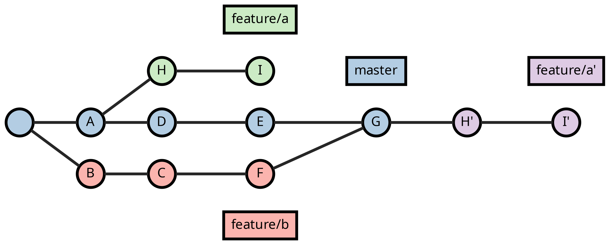

Render Code
===========

## Render 

```dot,render,class=image-shadow
digraph G {
    size = "16,9!";
    ratio = expand;
    rankdir = "LR";
    bgcolor = "transparent";

    node [
    width = 0.4,
    height = 0.4,
    fixedsize = shape,
    shape = circle,
    color = gray15,
    fontcolor = gray15,
    penwidth = 3,
    style = filled,
    fontname = "sans-serif",
    colorscheme = "pastel19"
    ];

    edge [weight = 2, color = gray15, arrowhead = none, penwidth = 3, splines = curved];

    node [group = master, fillcolor = 2, shape = circle, fixesize = shape];
    " " -> A -> D -> E -> G;
    node [group = "feature-a", fillcolor = 3];
    A -> H -> I;
    node [group = "feature-a'", fillcolor = 4];
    G -> "H'" -> "I'";
    node [group = "feature-b", fillcolor = 1];
    " " -> B -> C -> F -> G;

    node [shape = box, fixedsize = false, penwidth = 3];
    edge [penwidth = 0];

    node [fillcolor = 2];
    "master" -> G;
    {rank = same; G; "master";}
    node [fillcolor = 3];
    "feature/a" -> I;
    {rank = same; I; "feature/a";}
    node [fillcolor = 4];
    "feature/a'" -> "I'";
    {rank = same; "I'"; "feature/a'";}
    node [fillcolor = 1];
    F -> "feature/b";
    {rank = same; F; "feature/b";}
}
```
